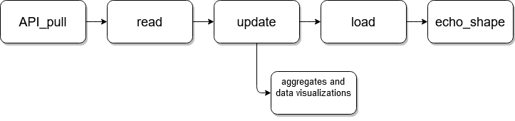

#  Teamweek - Monkeypox Data Pipeline

###  Contributors:

- [Jess Schueler](https://github.com/jessgschueler)

- [Bri Chavez](https://github.com/BriChavez)

- [Jarret Jeter](https://github.com/jarretjeter)

- [Dylan Peterson](https://github.com/DyPeterson)

###  Description:

Data Stack Academy team week project that downloads a kaggle dataset and runs it through a data pipeline. 

####  Programs used:

- [Visual Code Studio](https://code.visualstudio.com/)

- [Windows Terminal](https://apps.microsoft.com/store/detail/windows-terminal/9N0DX20HK701?hl=en-us&gl=US) ( Running: [WSL2](https://docs.microsoft.com/en-us/windows/wsl/install) ([ubuntu 20.04](https://releases.ubuntu.com/20.04/)))

####  Technologies Used:

- [Python](https://www.python.org/)

- [Apache Spark](https://spark.apache.org/)(Running [PySpark](https://spark.apache.org/docs/latest/api/python/) Module through Python)

- [Apache Airflow](https://airflow.apache.org/)

- [Pandas](https://pandas.pydata.org/)

- [Google Cloud Platform](https://cloud.google.com/)

###  Setup & Installation:

###  Useful Links:

####  Link to project on GitHub:

[GitHub](https://github.com/DyPeterson/monkeypox)

####  Link to Kaggle Dataset:

[Monkeypox Dataset](https://www.kaggle.com/datasets/deepcontractor/monkeypox-dataset-daily-updated)

###  Details:

This project downloads a daily updated CSV from Kaggle using Kaggle's API. Within the dataset, we download the "Daily_Country_Wise_Confirmed_Cases.csv". We then read that data to do a multitude of transformations. One of the transformations we run is cleaning the data and accounting for issues with the data that may occur. After we clean the data we update our existing data with the new data we receive from Kaggle. After updating our data we then upload it to the cloud through Google Cloud Services, first checking that the data we download is different from what currently exists. Also while updating we run the data through data visualization and aggregates to show different aspects of the data(example below).

###  Known Bugs:

No known bugs at this time.

###  Copyright 2022

Permission is hereby granted, free of charge, to any person obtaining a copy of this software and associated documentation files (the "Software"), to deal in the Software without restriction, including without limitation the rights to use, copy, modify, merge, publish, distribute, sublicense, and/or sell copies of the Software, and to permit persons to whom the Software is furnished to do so, subject to the following conditions:

The above copyright notice and this permission notice shall be included in all copies or substantial portions of the Software.

THE SOFTWARE IS PROVIDED "AS IS", WITHOUT WARRANTY OF ANY KIND, EXPRESS OR IMPLIED, INCLUDING BUT NOT LIMITED TO THE WARRANTIES OF MERCHANTABILITY, FITNESS FOR A PARTICULAR PURPOSE AND NONINFRINGEMENT. IN NO EVENT SHALL THE AUTHORS OR COPYRIGHT HOLDERS BE LIABLE FOR ANY CLAIM, DAMAGES OR OTHER LIABILITY, WHETHER IN AN ACTION OF CONTRACT, TORT OR OTHERWISE, ARISING FROM, OUT OF OR IN CONNECTION WITH THE SOFTWARE OR THE USE OR OTHER DEALINGS IN THE SOFTWARE.